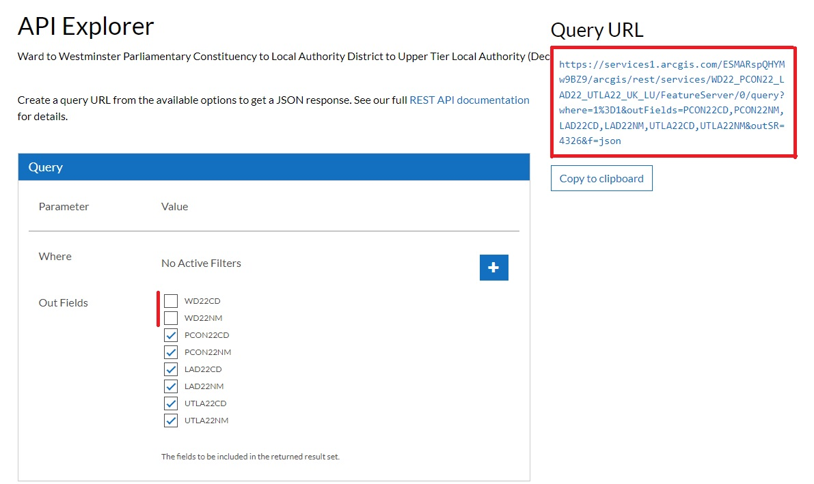
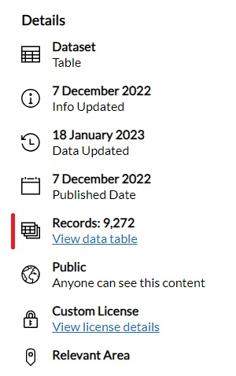
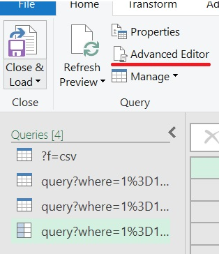
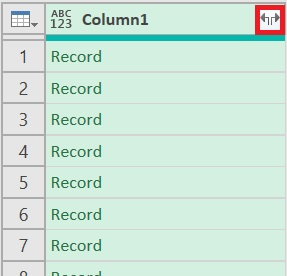

# Finding MPs for each LA using the ONS API

Because I am lazy and I needed the data in Excel, this tutorial covers how to use PowerQuery to download the data (so also appliccable to PowerBI). If you want to use R or Python you will need to find a RESTive API package that deals with panigation. It will probably be a lot easier :)

## Data Sources

We need data on which MP is in which constituency, which we can get from the theyworkforyou API [https://www.theyworkforyou.com/mps/?f=csv](https://www.theyworkforyou.com/mps/?f=csv) (Note that theyworkforyou does actually have an API, and this isn't it, but this is sufficient for us for now).

We also want data on which constituency is in which Local Authority, which is on the ONS Geoportal. The one for 2022 is [here](https://geoportal.statistics.gov.uk/datasets/ons::ward-to-westminster-parliamentary-constituency-to-local-authority-district-to-upper-tier-local-authority-december-2022-lookup-in-the-united-kingdom/about), and this is the dataset I'll use in this tutorial, as it's the most recent one when I'm writing this, but it should soon be out of date, and you should look for a newer version with updated LAs and constituency boundaries.

## Downloading the data

So were done right? Just download the data from each source and then `INDEX/MATCH` / `left_join` them together? WRONG!

There are two problems, one more easily solved than the other.

1. We need to use the API to download the LA data, but by default it will only download the first 1000 objects. Unfortunately, because the file also contains all of the information on wards as well as constituencies, there are over 9000 datapoints in the file, so we need a way to get around this.
1. The two inputs are in different formats, the MP data is in a CSV, which is a lovely rectangle while the LA data is in JSON format, which is very much not a rectangle. 

## Downloading the API data.

We can navigate to the API explorer by pressing "View Full Details" then clicking "View API Resources" on the right hand side, then "Open in API Explorer", or by changing the last part of the url to `/api`. Here we select the columns we need (you can see in the image that I have deselected the two columns for Wards), and copy the query url, which we can use to download the data. 



We need to know how many items there are in this dataset in order to know how many pages of data to read. You're supposed to be able to get this from the API, but it seems to be broken, (it just says 0), and so we can get this off the about page instead (either click back on "Back to Full Details" link, or change the end of the url to `/about`.) Here we can see that there are about 9300 records. 

.

Looking at the API link: 
```
https://services1.arcgis.com/ESMARspQHYMw9BZ9/arcgis/rest/services/WD22_PCON22_LAD22_UTLA22_UK_LU/FeatureServer/0/query?where=1%3D1&outFields=PCON22CD,PCON22NM,LAD22CD,LAD22NM,UTLA22CD,UTLA22NM&outSR=4326&f=json
```

we can see that it is a series of instructions split apart by `&`. 

We can change the results we recieve by adding in a `resultOffset` query, which, rather than beginning at the first result, will get the server to return the 1000 results beginning at the requested entry. So if we add in `resultOffset=1000`, it will give us results 1001 to 2000. 

<details>
    <summary>What do the other instructions do?</summary>

 - `**where**=1%3D1` would allow us to run SQL style `WHERE` commands on the data, e.g. only select rows where `population > 10000` for example. Here we select all of the rows, and so we have `where=1=1` (with `=` encoded as `%3D`)

 - `outfields=...` List of fields to output

 - `outSR=4326` This means nothing for our data, but if we had requested map data (which is what the API is nominally for), it would change the spatial reference of the map.

 - `f=json` output as JSON. Sadly this is actually the most readable of the options for us. 

 You can learn more about the query options on the [arcgis website](https://developers.arcgis.com/rest/services-reference/enterprise/query-feature-service-layer-.htm)
</details>

We therefore want to repeatedly request the next 1000 entries by increasing the `resultOffset`, and stick them all together into a single large JSON object which we can then process. 

<details>
    <summary>
## Doing this in Excel
    </summary>

In Excel/PowerBI we can do this using PowerQuery. Again, there are better ways to do this in R and Python. 

In the Data tab, select "Get Data" and then "From Other Sources" and "From Web" (or use the little icon) . Paste the URL in the box and press OK, which will open up PowerQuery.

Here we disregard all of the buttons trying to help us, and open the Advanced Editor.



We can then replace the code in the box (which will only download one page), with some to download all of the pages:

``` VBA
let
    BaseURL = "https://services1.arcgis.com/ESMARspQHYMw9BZ9/arcgis/rest/services/WD22_PCON22_LAD22_UTLA22_UK_LU/FeatureServer/0/query?where=1%3D1&outFields=PCON22CD,PCON22NM,LAD22CD,LAD22NM,UTLA22CD,UTLA22NM&outSR=4326&f=json", //Change this URL to your own
    EntitiesPerPage = 1000, // This is fixed by the server
    MaxEntities = 10000, // This is a little over-cautious, but will hopefully not need to be changed if they add more wards

    GetPage = (Index) => // This function gets the page
        let Skip = "&resultOffset=" &Text.From(Index * EntitiesPerPage),
            Url = BaseURL & Skip,
            Json = Json.Document(Web.Contents(Url)),
            Value = Json[features] // Each JSON record holds a lot of data, but we only want the "features"
        in Value,

    PageCount = Number.RoundUp(MaxEntities/EntitiesPerPage), // Work out how many pages are needed
    PageIndicies = { 0 .. PageCount - 1}, // Make a list with each page number in it
    Pages = List.Transform(PageIndicies, each GetPage(_)), // For each page number, replace the number with the actual page from the server
    Entities = List.Union(Pages), // Combine the pages together
    Table = Table.FromList(Entities, Splitter.SplitByNothing(), null, null, ExtraValues.Error) // Convert the list into a PQ table
in
    Table
```

Pressing "Done" should cause a little loading, and then a column full of records will appear. Each record contains a list of attributes, which contain the data that we want, so we need to expand the column, into `Column1.attributes`:



 and then expand the column of attributes to get all of the columns. Deselect the "Use original column name as prefix", as this only muddies up the names, with no benefit to us here. 

 [!Image showing Column Expansion menu](./img/la_mp_tut_pq_second_column.jpg).

 We still have too many columns though, as each constituency shows up once for each ward. Select the first four columns by licking the first column heading, and shift-clicking the fourth (this should select the columns with the ONS codes and names of the constituencies and Lower tier LAs). Then in the "Home" tab select "Remove Rows" and "Remove Duplicates".

 (We need to select the first four columns rather than just the one for constituences because some constituencies are in more than one LA).

 Pressing "Close and Load" will then import the data into Excel.

 ## Downloading the MP data

 This is much simpler. Here we use the same get data from web feature in Excel , and this time use the direct link to the csv from theyworkforyou [https://www.theyworkforyou.com/mps/?f=csv](https://www.theyworkforyou.com/mps/?f=csv), however this time the default settings work fine, and we can simply import the sheet. 

 To make our life a bit easier, we can rename this query (probably called `f=csv`) by going to "Queries & Connections" in the "Data" tab, right-clicking the query, and renaming it (I called it `)

 ## Matching the data

 Luckily for us, the column `PCON22NM` (possibly with a different year number if you used different data), uses exactly the same names as the `Constituency` column in the theyworkforyou data, and so now you CAN simply `INDEX/MATCH` them. If you want to quickly add them to the right of the data from the API, you can use the array forumula

 ```
 =XLOOKUP([@PCON22NM],mp_constituencies[Constituency],mp_constituencies[First name],"-",0)
 ```
 in I2,
 ```
 =XLOOKUP([@PCON22NM],mp_constituencies[Constituency],mp_constituencies[Last name],"-",0)
 ```
 in J2 and 
```
=XLOOKUP([@PCON22NM],mp_constituencies[Constituency],mp_constituencies[Party],"-",0)
```
in K2. 

(Yes it's not `INDEX/MATCH` and it doesn't work in old versions of Excel, but it'll do.)

Now you have a nice rectangle of all of the MPs and which LA they're in. You can update it at any time by going to the "Data" tab and pressing "Refresh All".
</details>

<details>
<summary>
## Doing this in R
</summary>

There is a sample script for doing this [here](./sample%20code/R/getmps.R). 

We're going to use the `httr` and `jsonlite` packages to download the data. Unfortunately, R doesn't have a standard method of reading JSON (and thus APIs), and different packages handle JSON quite in incompatible ways. Just be aware that if you're using another JSON parser (say `rjson` or `tidyjson`), they can behave quite differently.

`httr` allows us to separate the query part of the API (everything after `?`) into a list and manipulate it separately, and so we can define our urls and queries at the top (remember to change out the arcgis link if there is a new one)

``` R
mp_data_loc <- "https://www.theyworkforyou.com/mps/?f=csv"
la_data_loc <- "https://services1.arcgis.com/ESMARspQHYMw9BZ9/arcgis/rest/services/WD22_PCON22_LAD22_UTLA22_UK_LU/FeatureServer/0/query"
la_data_query <- list(where = "1=1",
                    outFields = "PCON22CD,PCON22NM,LAD22CD,LAD22NM,UTLA22CD,UTLA22NM",
                    outSR = "4326",
                    f = "json")
```

Reading the MP data is simple, and can just be done using `read.csv` on the link. There are two columns we don't want though, the `Person ID` and the `URI` and so we can remove them. 

``` R
mp_list <- subset(read.csv(mp_data_loc), select = -c(Person.ID, URI))
```

For the LA data, we can use `httr` to gain a single page of results with `GET`. `res <- GET(la_data_loc, la_dataquery)` will get the first 1000 lines, however if you try to read it (using `res$content`) you will just get a load of numbers. The result is returned as raw data, and so we need to convert it to strings using `rawToChar(res)`. We can then use `jsonlite` to convert the JSON string to a dataframe. 

JSON is not a rectangular data structure (it's a tree, like XML), and so we need to flatten it in order to get it to work properly in a dataframe. Luckily the data here is already basically a rectangle, and so we can just use `fromJSON`'s `flatten = TRUE` argument, however with more complex datasets there can be quite a lot of wrangling. Even here, we still only want the `features` of the data (the rest is used when dealing with map data from this API, but we don't have that here luckily. More generally you will need to look at the JSON coming out of your API to work out where the data you want is. If it's not confidential, tools like [JSONviewer](https://jsonviewer.stack.hu/) can really help with this). 

We can get a page of results back starting at result `x` with the function

``` R
get_starting_at_x <- function(x, url, query) {
    query_with_offset <- c(query, list(resultOffset = as.character(x)))
    res <- GET(url, query = query_with_offset)
    # each JSON record holds a lot of data, but we only want the "features"
    features <- fromJSON(rawToChar(res$content), flatten = TRUE)$features
    return(features)
}
```

Notice that the first argument is the starting result number. This is because we're going to be repeatedly calling this function with different starting numbers, and we can use `lapply` to do this if the variable we want to change is the first argument.

We want to call the function with `x` being every multiple of 1000 between 0 and 9000, and so we can generate this list using `(seq_len(10) - 1) * 1000` (sequences in R always betwen at 1, so we subtract 1 from every term in the sequence to get what we want). To get a more general function, we can define `entities_per_page` and `max_entities` at the top, and then we get `(seq_len(max_entities / entities_per_page) - 1) * 1000`.

We want to run `get_starting_at_x` for every entry in our sequence, and this is what `lapply(list, f)` is for. It takes every item in the list, and runs the function `f` with that item as the first argument. Then it returns a list with the corresponding outputs of `f` for every item in the original list.

Our function takes two more arguments, `url` and `query`, but we can put them after the function and they will be added in every time. (They won't be stepped through though. For that we would need to use `mapply` or `purr::pmap`). 

``` R
entities_per_page <- 1000
max_entities <- 10000

lapply(
    seq_len(max_entities / entities_per_page) - 1) * 1000,
    get_starting_at_x,
    url = la_data_loc,
    query = la_data_query
    )
)
```
This gives us a list of dataframes, one for each page. Because they all have the same columns in, we can combine them together using `bind_rows`.

Looking at the data, many of the rows appear multiple times. This is because the data is actually by ward, we simply didn't ask the API for the ward columns. We only want unique, rows, and thus we can use `unique()` to remove repeats, giving us

``` R
entities_per_page <- 1000
max_entities <- 10000

local_authorities_const <- unique(
    bind_rows( 
        lapply( 
            (seq_len(max_entities / entities_per_page) - 1) * 1000,
            get_starting_at_x,
            url = la_data_loc,
            query = la_data_query
        )
    )
)
```

This is good, but because of the JSON flattening, every columnname starts with "attributes.". Rather than doing anything complicated, we can simply remove the first 11 characters of every name (`substr` requires that you have an end to the section of string you want to cut out, so we set it to a figure much longer than all of the strings to ensure that it doesn't remove anything unwanted.)

``` R
names(local_authorities_const) <- substr(names(a), 12, 1000)>
```

Lastly we want to join our local authorities data to the mp data. Here we use the base R function `merge`, but the tidyverse function `left_join` does the same thing in a more predictable manner if you are using tidyverse.

``` R
la_with_mp <- merge(local_authorities_const,
                mp_list,
                all.x = TRUE,
                by.x = "PCON22NM",
                by.y = "Constituency")
```

(Here `all.x = TRUE` is what makes it a left join. The default for `merge` is an inner join, which is rarely what you want)

</details>