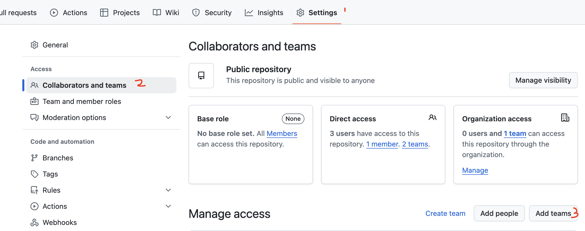
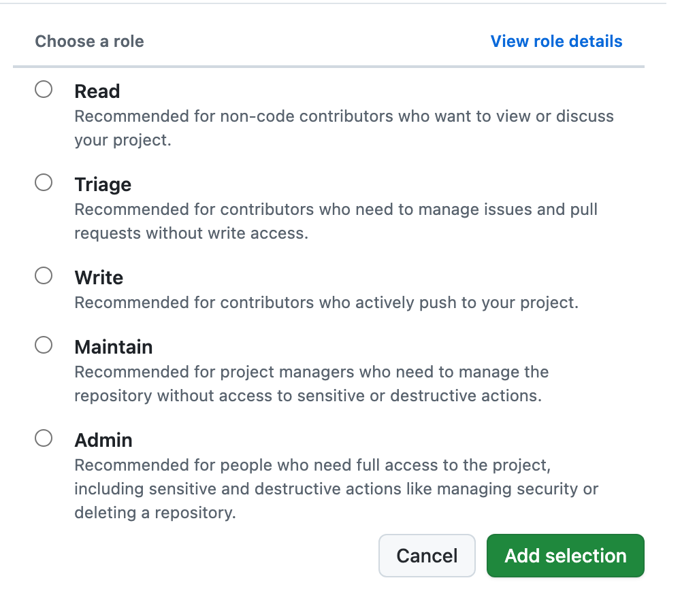

# Adding team access to repos

Giving a team access to a repo has two major benefits

1. It allows you to control access to repos based on people's status in the team, rather than needing to manage individual accounts
2. It significantly improves searchability by collecting all repos with team permissions together in a single place

---

To give all members of a specific team access to a repo:

- Make sure that the repo is part of the correct organisation (i.e. it's in communitiesuk), and that you are an admin or maintainer of the repo (you can see the settings cog at the top of the screen)
- Go to the Settings cog at the top, and then Collaborators and Teams on the left hand side 
- Then add a team by pressing the Add Teams button and search for the team you want
- You'll then get to choose what access you would like to give the team. Consider carefully what default access you would like for the team to have. It is very likely that you want for the team to have `Write` or `Maintain` access. Think very carefully before choosing `Admin`. 
- All members of the team will then be given the specified permission on the repo, and it will appear under the "Repositories" list on their team page.