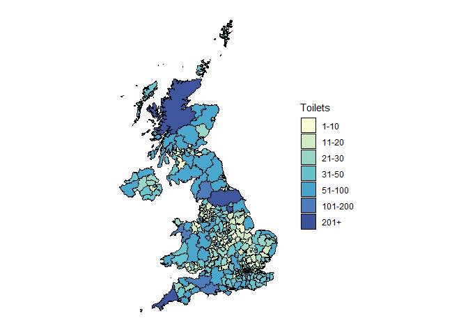
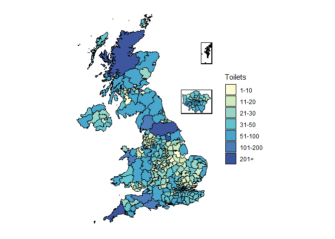

Maps with London Inset
================

# Imports

``` r
library(tidyverse)
library(sf)  #Reads sf files
library(sp) #Spatial data library
library(classInt) #Puts data into buckets
library(RColorBrewer) #Makes colour palettes
```

We need to get the boundaries from somewhere. We can either use some we
already have (which we’ll do here), or we can download new ones

<details>
<summary>
Getting different boundaries
</summary>

We usually get our boundaries from the [ONS
Geoportal](https://geoportal.statistics.gov.uk/). It’s a little
bemusing, but you generally to look in the menu under Boundaries,
Administrative Boundaries.

If you need districts, you want “Local Authority Districts”, which also
contains metropolitan districts and UAs. If you don’t want districts,
you probably want “Counties and Unitary Authorities”.

Pay attention to which year your data is from, as you’ll need the
correct boundaries for that year. You probably want the filed labelled
“BUC”, as that has the least detail and will take the least time to
process. The others will work though.

We want the download labelled “shapefile”. Unzip all of the files from
the zip into your target directory. (You do want all of them, `shp`
files store their metadata in separate files)
</details>

Here we’ll use a file downloaded from Geoportal containing all of the
districts and unitaries from 2023.

``` r
shp_boundaries <- "includes/LAD_DEC_2023_UK_BUC.shp"
la_boundaries <- st_read(shp_boundaries)
```

    ## Reading layer `LAD_DEC_2023_UK_BUC' from data source `D:\Users\peter.brohan\Documents\git\tutorials\includes\LAD_DEC_2023_UK_BUC.shp' using driver `ESRI Shapefile'
    ## Simple feature collection with 361 features and 8 fields
    ## Geometry type: MULTIPOLYGON
    ## Dimension:     XY
    ## Bounding box:  xmin: -116.1928 ymin: 7054.1 xmax: 655653.8 ymax: 1220310
    ## Projected CRS: OSGB36 / British National Grid

Sf objects are based on dataframes, and so we can use most of the normal
data wrangling functions in R. If we examine the data:

``` r
print(colnames(la_boundaries))
```

    ## [1] "LAD23CD"  "LAD23NM"  "LAD23NMW" "BNG_E"    "BNG_N"    "LONG"     "LAT"      "GlobalID" "geometry"

We can see that the data comes with names, (`LAD23NM`) ONS Codes
(`LAD23CD`) as well as names in Welsh for Welsh areas (`LAD23NMW`), a
collection of geographical information for both the British National
Grid coordinate system and lat/long, and finally the geometry for the
areas themselves.

We’ll import the data that we want to plot (number of public toilets per
LA from <https://www.toiletmap.org.uk/>) and then join them together.

``` r
data <- read_csv("includes/toilets.csv", show_col_types = FALSE)

la_data <- la_boundaries |>
   select("ONSCode" = "LAD23CD") |>
    right_join(data, by = "ONSCode")
```

It’s important that we join the data this way around (starting with the
geometry and joining the data we want plotting), because otherwise R
will output a `tibble` rather than the `sf` geography object that we
want.[^1]

# Bucketing data

Because we’re planning to draw two maps and combine them together, we
can’t let ggplot decide on our buckets for us, as it might decide on
different buckets for the different maps!

Here we make a new column called “info_class”, use `cut()` to fill it
with a `factor` saying which interval each LA lies in. Here I’ve defined
my buckets as 1-10, 11-20, 21-30, 31-50, 51-100, 101-200 and 201-350.
Setting `include.lowest` to `FALSE` puts the bucket bounds into the
previous bucket. We set `dig.lab` to 10 to prevent the automatically
created labels from having exponents.

``` r
#Use cut to define your own buckets. dig.lab stops it from using exponents
bucket_bounds <- c(0,10,20,30,50,100,200,350)

la_data_classes <-la_data %>%
  mutate(info_class = cut(`toilets`, bucket_bounds, include.lowest=FALSE, dig.lab=10))

head(la_data_classes)
```

    ## Simple feature collection with 6 features and 4 fields
    ## Geometry type: MULTIPOLYGON
    ## Dimension:     XY
    ## Bounding box:  xmin: 344674 ymin: 378867 xmax: 478232.6 ymax: 537152
    ## Projected CRS: OSGB36 / British National Grid
    ##     ONSCode                 name toilets                       geometry info_class
    ## 1 E06000001           Hartlepool      11 MULTIPOLYGON (((448973.6 53...    (10,20]
    ## 2 E06000002        Middlesbrough      25 MULTIPOLYGON (((451894.3 52...    (20,30]
    ## 3 E06000003 Redcar and Cleveland      22 MULTIPOLYGON (((478232.6 51...    (20,30]
    ## 4 E06000004     Stockton-on-Tees      31 MULTIPOLYGON (((452243.5 52...    (30,50]
    ## 5 E06000005           Darlington       5 MULTIPOLYGON (((436388 5223...     (0,10]
    ## 6 E06000006               Halton      24 MULTIPOLYGON (((358131.9 38...    (20,30]

The labels `cut` generates are accurate, but usually not what we want,
so we can define custom labels for each one by renaming the levels of
the factor. You need to name *every* bucket, so here I have 7 buckets,
and so must supply seven labels.

``` r
levels(la_data_classes$info_class) <- c(
  "1-10", "11-20", "21-30", "31-50", "51-100", "101-200", "201+"
)

head(la_data_classes)
```

    ## Simple feature collection with 6 features and 4 fields
    ## Geometry type: MULTIPOLYGON
    ## Dimension:     XY
    ## Bounding box:  xmin: 344674 ymin: 378867 xmax: 478232.6 ymax: 537152
    ## Projected CRS: OSGB36 / British National Grid
    ##     ONSCode                 name toilets                       geometry info_class
    ## 1 E06000001           Hartlepool      11 MULTIPOLYGON (((448973.6 53...      11-20
    ## 2 E06000002        Middlesbrough      25 MULTIPOLYGON (((451894.3 52...      21-30
    ## 3 E06000003 Redcar and Cleveland      22 MULTIPOLYGON (((478232.6 51...      21-30
    ## 4 E06000004     Stockton-on-Tees      31 MULTIPOLYGON (((452243.5 52...      31-50
    ## 5 E06000005           Darlington       5 MULTIPOLYGON (((436388 5223...       1-10
    ## 6 E06000006               Halton      24 MULTIPOLYGON (((358131.9 38...      21-30

# Setting the Colours

Now we need to generate the colour palette. Because R generates the
subplot separately, it doesn’t necessarily place all of the locations in
the inset map in the same bucket (in this example, if there are no
values in the 1-10 bucket, then the 11-20 bucket will be lowest one and
will therefore recieve the first colour) and the scale for the inset map
will be coloured differently. To avoid this we will specifically match
the names of our buckets to levels in the colour scale.

``` r
# Get a palette from brewer
col_palette <- brewer.pal(length(bucket_bounds) - 1, "YlGnBu")

# Asign the names from the levels to the palette
names(col_palette) <- levels(la_data_classes$info_class)

# Make a scale using ggplot2 
col_scale <- scale_fill_manual(name = "Toilets", values = col_palette)
```

<details>
<summary>
Making your own palette
</summary>

`brewer.pal` just makes a vector of hex colour codes, and so if you
would like to make your own palette, you can just replace the first line
with a vector of the colours you would like using in order,
e.g. `col_palette <- c("#ffffff", "#cccccc", "#000000")` will make a
palette of length 3 going from white to black.

Remember that it needs to be the same length as the number of buckets
you have or you will get an error.
</details>

Finally, we’re ready to make the map.

# Generate the big map

We start by generating the large map using all of our data. This is
mostly the same as making a normal plot in ggplot, we’re using the
dataset `la_data_classes` and we are setting the aesthetics `geometry`
to the `geometry` column, and we want to fill the geometries using the
`info_class` column.

`geom_sf` adds the map data to the plot, we’ve set the opacity (`alpha`)
to 0.8, we want the outline (`colour`) to be black, and we want it to be
quite thin so the size it set to (`0.3`).

We also want to get rid of the background, label and axes that plots
usually have, and we use our scale `col_scale` to colour in the regions.

``` r
p <- ggplot(la_data_classes, aes(geometry = geometry, fill = info_class)) +
  geom_sf(alpha = 0.8,
          colour = 'black',
          size = 0.3) +
  labs(x = NULL, y = NULL)+
  col_scale +
  theme(panel.background = element_blank(),
        line = element_blank(),
        axis.text = element_blank())

p
```

<!-- -->

# Make the London Insert

Now we want to generate just the inset map of London. There are a number
of ways to do this, but the easiest is just to select only the LAs which
are in London (whose ONSCode begins with “E090”) and plot only them.

We create a small map using only that data and the same scale so that we
can add it to the other map. The only difference here is that we’ve
added a border to the map to help us to distinguish it. We also remove
the legend as we would like the to only display on the larger map.

``` r
la_data_london <- la_data_classes |> filter(str_detect(ONSCode, "E090")) 
p_zoom_london <- ggplot(la_data_london, aes(geometry = geometry, fill=info_class)) +
  geom_sf(alpha = 0.8,
          colour = 'black',
          size = 0.3) +
  labs(x = NULL, y = NULL)+
  col_scale +
  theme(panel.background = element_blank(),
        line = element_blank(),
        axis.text = element_blank(),
        panel.border = element_rect(colour = "black", fill=NA, linewidth=1),
        legend.position = "none")

p_zoom_london
```

<!-- -->

We then need to have ggplot2 render the London map so that it knows what
to add to the large map. We can do this using the `ggplotGrob` function,
which will render the map to the primitive shapes ggplot2 uses to build
graphs.

``` r
p_grob_london <- ggplotGrob(p_zoom_london)
```

# Add it all together

Now we need to add the grob in to the original map. This is the most
painful part as we need to use OSGB36 coordinates to place the inset
physically on the larger map somewhere. The coordinates are in OSGB36
coordinates, which is a horrible trap. You can learn all about it
[here](https://www.ordnancesurvey.co.uk/documents/resources/guide-coordinate-systems-great-britain.pdf),
and you can convert long/lat coordinates into OSGB36 using [this
calculator](https://webapps.bgs.ac.uk/data/webservices/convertForm.cfm).

Here I’ve just used trial-and-error to move the map away from the edges
until it’s somewhere nice. Note that it won’t stretch the map at all,
instead it makes the inset as large as it can be inside the defined area
without distorting it, and then places it at the centre of the defined
area. This can make for quite a frustrating time placing it as it can be
difficult to work out exactly how large it will be and effect changing
the dimensions can have.

This also means that it will render the images differently if you are
rendering them to different sizes, (e.g. if you’re making them in an
rmarkdown document, so be sure to check that whatever you have selected
works in your chosen output format. )

``` r
p3 <- p +
  annotation_custom(grob = p_grob_london,
                    xmin = max(la_boundaries$BNG_E) - 150000,
                    xmax = max(la_boundaries$BNG_E) + 50000,
                    ymin = min(la_boundaries$BNG_N),
                    ymax = min(la_boundaries$BNG_N) + 1200000)


# If your map is only of England, these coordinates will usually place the inset nicely in the bottom-right corner
#  annotation_custom(grob = p_grob_london,
#                    xmin = max(la_boundaries$BNG_E) + 50000,
#                    xmax = max(la_boundaries$BNG_E) + 300000,
#                    ymin = min(la_boundaries$BNG_N) + 15000,
#                    ymax = min(la_boundaries$BNG_N) + 180000)

p3
```

<!-- -->

# Shetland

We could do something similar with Shetland to make the map a bit
shorter

``` r
# Make a Shetland map
la_data_shetland <- la_data_classes |> filter(ONSCode == "S12000027") 
p_zoom_shetland <- ggplot(la_data_shetland, aes(geometry = geometry, fill=info_class)) +
  geom_sf(alpha = 0.8,
          colour = 'black',
          size = 0.3) +
  labs(x = NULL, y = NULL)+
  col_scale +
  theme(panel.background = element_blank(),
        line = element_blank(),
        axis.text = element_blank(),
        panel.border = element_rect(colour = "black", fill=NA, linewidth=1),
        legend.position = "none")

p_grob_shetland <- ggplotGrob(p_zoom_shetland)


# Remove Shetland from the large map
p_no_shetland <- ggplot(la_data_classes |> 
        filter(ONSCode != "S12000027"), aes(geometry = geometry, fill = info_class)) +
  geom_sf(alpha = 0.8,
          colour = 'black',
          size = 0.3) +
  labs(x = NULL, y = NULL)+
  col_scale +
  theme(panel.background = element_blank(),
        line = element_blank(),
        axis.text = element_blank())

two_insets <- p_no_shetland +  
  annotation_custom(grob = p_grob_london, 
                    xmin = max(la_boundaries$BNG_E) - 150000,
                    xmax = max(la_boundaries$BNG_E) + 50000,
                    ymin = min(la_boundaries$BNG_N),
                    ymax = min(la_boundaries$BNG_N) + 1200000) +
  annotation_custom(grob = p_grob_shetland,
                    xmin = max(la_boundaries$BNG_E) - 50000,
                    xmax = max(la_boundaries$BNG_E) + 50000,
                    ymin = max(la_boundaries$BNG_N) - 500000,
                    ymax = max(la_boundaries$BNG_N) - 150000
                    )

two_insets
```

<!-- -->

# Saving the map

We can save our map to file using ggsave. To prevent everything from
breaking, we set the DPI to an acceptable print quality. This also stops
all of the insets from moving around.

``` r
ggsave("map_with_shetland.jpg", plot=two_insets, dpi=300)
```

    ## Saving 7 x 5 in image

<!-- Also to add - 
# Using Leaflet
# Adding backgrounds from Openmapwhetever
-->

[^1]: In this example it doesn’t actually matter too much, but some
    functions are expecting `sf` objects, which can create some very
    bemusing errors.
